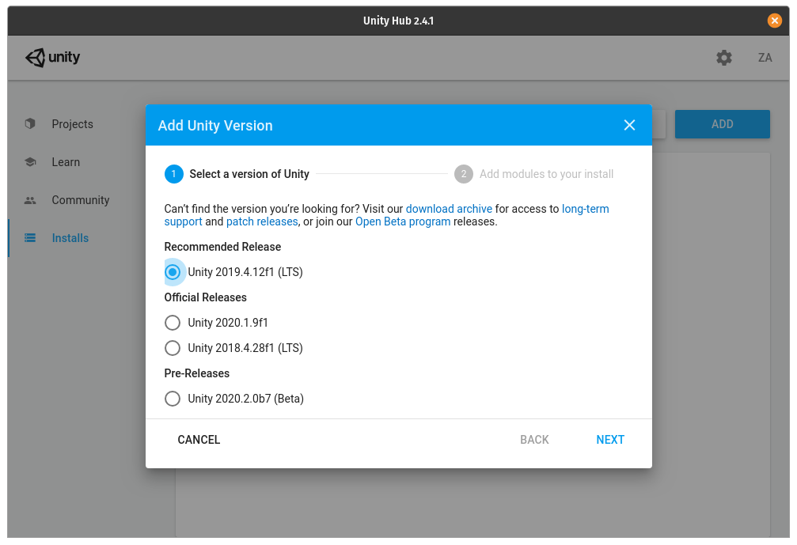

# Contributing

## Prerequisites
- GPU capable PC
- A supported OS
    - Windows 10
    - MacOSX
    - Linux (with appimage support)

## Installing Unity and setup the editor

#### Install Unity Hub

- Download Unity Hub for your OS
    - https://unity3d.com/get-unity/download

- Run the installer and launch Unity Hub

#### Install the correct version of unity and the modules

- Go to Installs

- Click add
- Select the recommended LTS version of unity 2019.4

  

- Click next
- Select the required modules
- Android Build support
    - Android SDK and NDK Tools
    - OpenJDK

  

- Click next and wait for the unity version to finish downloading
  
